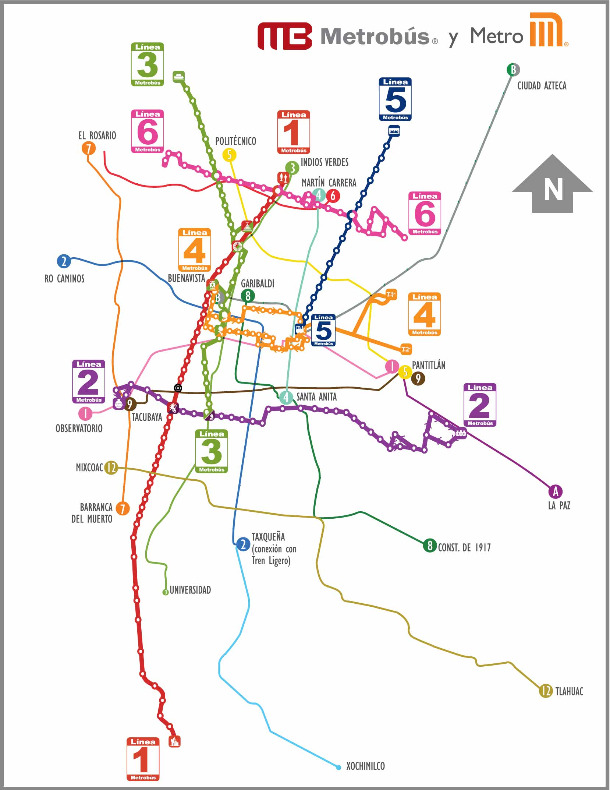

# MiniRouter IA
Sistema de inteligencia artificial que usa múltiples estrategias de razonamiento para planear rutas, debe hacer lo mismo pero en un dominio diferente, (metro y metrobus CDMX).

Programar un mini-Router y realizar experimentos con él. 
Combina aspectos de:
 * Razonamiento basado en casos
 * Razonamiento a través de un modelo/mapa organizado jerárquicamente
 * Búsqueda A* (cuando debe buscar dentro de una sola zona dentro de su mapa jerárquico). 

Tipos de experimentos interesantes
 * ¿Alguno de los métodos de razonamiento que utiliza el sistema es más eficiente que los otros? 
 * ¿Alguno de los métodos de razonamiento que utiliza el sistema garantiza la obtención de soluciones de mejor calidad que los otros?
 * ¿Integrar los tres métodos de razonamiento es mejor que utilizar cualquiera de ellos por separado? 
 * ¿A partir de qué momento resulta ser contraproducente seguir almacenando casos específicos de problemas resueltos (y cómo medirlo para que un sistema sea capaz de auto-monitorearse y decidirlo)? 

Para realizar este proyecto parte de la investigación independiente que se tendrá que realizar consistirá en la obtención y captura del conocimiento geográfico relevante (por ejemplo, coordenadas, distancias, tiempos de recorrido, conexiones) que se necesite para describir el espacio dentro del cual se van a planear las rutas.

Elegir una función heurística adecuada (puede depender de la disponibilidad de datos adecuados) para la ejecución del algoritmo A*.

## Base de conocimiento
Se obtuvo la información del portal de datos de la Ciudad de México.

### Formato de estaciones
        station(sistema, estacion, lat, long, linea, orden).
Ejemplos:

        station(metro,tlahuac,19.28680057,-99.01443243,12,19).
        station(mb,indios_verdes,19.496784,-99.119728,1,1).

## Mapa de la red de metro y metrobus

